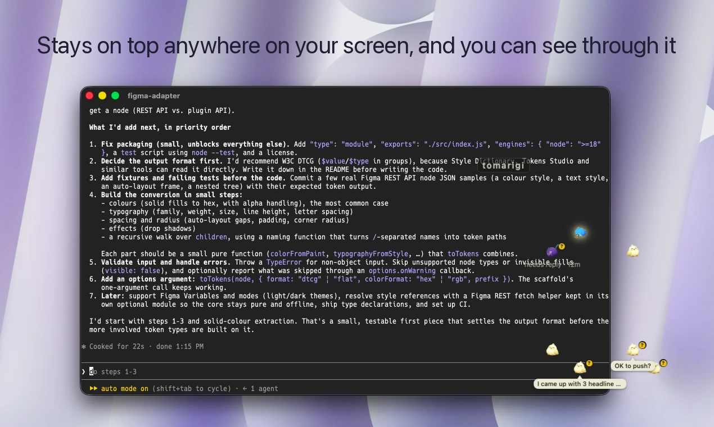
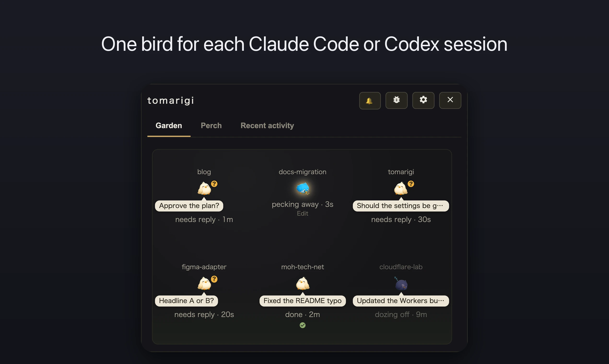
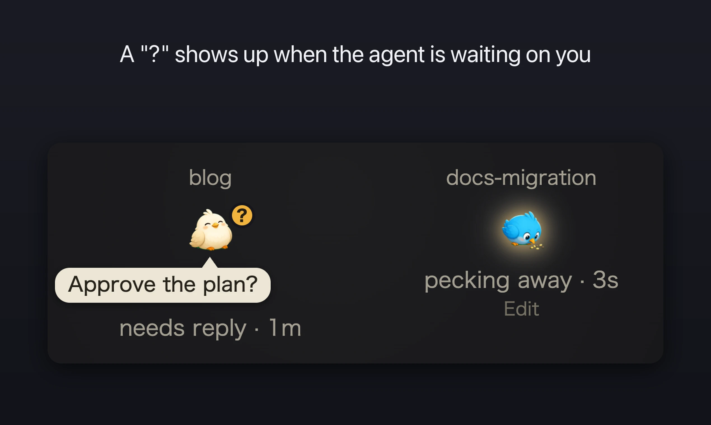
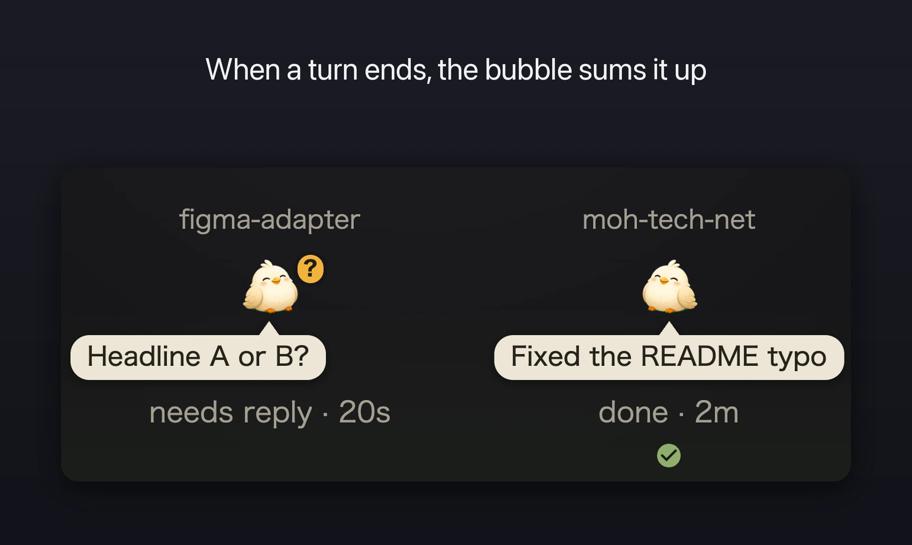

# Tomarigi

A macOS app that watches your AI coding agent sessions (Claude Code / Codex) as birds in an always-on-top window. Each session gets its own bird in the Garden, so you can tell at a glance which one is working, which one is waiting for your reply, and which one is done. Click a bird to jump to the Ghostty pane where that session is running.

- In the floating window's Garden, only the birds, their bubbles, and the "tomarigi" handle are shown, and clicks go through to the window below. Click the handle to show the whole window; drag it to move the window
- Icon sets: Birds, Gnome, Cat, Robot, and Frog, assigned per project
- No hooks or config changes on the agent side. It only reads the transcripts under `~/.claude/projects` and `~/.codex/sessions`
- Optional BYOK keys: OpenAI or Anthropic for the speech bubble that summarizes each finished turn, and TypeSafe for spotting questions asked in plain text (the "?") and abuse toward the AI (the anger mark). Voice readout uses the system speech synthesizer and needs no key
- Requirements: macOS. Jumping to a pane works with Ghostty only

| | |
|---|---|
|  |  |
|  |  |

The design spec lives in docs/design.md.

## Build

```sh
bun install                   # prepare sets core.hooksPath to .githooks and enables the gitleaks pre-commit hook
bun run dev                   # run the dev app (tauri dev; also starts the vite dev server, bun run dev:web)
bun run build:verify          # verification .app (src-tauri/target/debug/bundle/macos/tomarigi-desktop (verify).app) with a greenish background. Signed with your local Apple Development certificate (scripts/build-verify.sh; override with APPLE_SIGNING_IDENTITY)
bun run tauri build --debug   # src-tauri/target/debug/bundle/macos/tomarigi-desktop.app
bun run tauri build           # release build. Put the resulting .app at /Applications/tomarigi-desktop.app
bun run gen:locales           # scripts/locales/*.mjs → public/_locales/*/messages.json (also runs in bun run build)
bun run verify:locales        # checks that all 43 locales have exactly the same keys
bun run test                  # tests/ (bun test) and the Rust unit tests (cargo test --lib)
```

Distribution builds are made by CI when a `v*` tag is pushed (signed, notarized, attached to a draft GitHub Release). See docs/release.md.

The everyday build (/Applications), `bun run dev`, and `bun run build:verify` use different identifiers (`src-tauri/tauri.dev.conf.json` and `tauri.verify.conf.json` are layered with `--config`). Single-instance locking, settings, and window position are separate for each, so they can run side by side. Each one asks for Ghostty automation permission on first use. Agents that launch the app for verification should only launch the verify .app (so they don't stop the everyday build or dev).

`public/_locales` is generated. Don't edit it directly; write every locale in scripts/locales/*.mjs and generate.

The dev server port is fixed at 4842 in `vite.config.ts` and `src-tauri/tauri.conf.json`. HMR uses port 4843 only when `TAURI_DEV_HOST` is set (running the dev app on another device).

Environment variables at launch (pass them when running the binary `Contents/MacOS/tomarigi-desktop` directly):

- `TOMARIGI_MOCK=1`: mock mode. Injects presets / JSON instead of real data. The mock screen also opens in a plain browser at `http://localhost:4842/?mock=1` while the dev server runs (`bun run dev:web`)
- `TOMARIGI_QUERY`: initial screen. Join `tab=perch` / `tab=events` / `settings=1` / `debug=1` / `preset=<id>` (initial mock preset; `preset=asking` shows the "?") / `scrollTo=<class name>` (scrolls the window to that element, e.g. `settings=1&scrollTo=window-mode`) / `cycle=<seconds>` (mock: every few seconds changes one thing on the birds in turn, a bubble, a tool line, a watch link, a bird joining or leaving; logged as `[mock-cycle]`) / `panel=0` (mock: hides the mock controls) / `birds=<n>` (mock: adds n plain birds) / `tint=0` (verify build: skips the greenish background, so screenshots show the everyday look) with `&`
- `TOMARIGI_FOCUS_TEST="<config_dir>|<sessionId>|<return tty>"`: 3 seconds after launch, jumps to that session's Ghostty pane, then 1.5 seconds later jumps back to the return pane (logs `front=<tty>`)
- `TOMARIGI_FADE_TEST=1`: "Fade until hovered" self-test. 4 seconds after launch, shows the faded Garden as clicking the window handle would, keeps it shown for 6 seconds as if the cursor were in the window, then lets it fade again (logs `[fade-test] reveal` and `[fade] revealed=...`)
- `TOMARIGI_MODE_TEST`: window mode self-test. `1` cycles standard → floating → standard → maximized → full screen → floating every 5 seconds; `normal` just switches to the standard window
- `TOMARIGI_IMPORT_KEY=<anthropic|openai|typesafe>`: saves the first line of stdin as that provider's API key (for checking without operating the settings screen by hand; only the length is logged)
- `TOMARIGI_KEY_BACKEND=webview`: stores keys in IndexedDB instead of the Keychain (for testing the IndexedDB → Keychain migration)

Where BYOK API keys are stored depends on the identifier (KeyStore in src-tauri/src/keys.rs); see "BYOK API keys" in docs/design.md.

Logs are appended to `/tmp/tomarigi-desktop/app-log.txt`.

The Rust tauri crates are pinned to match `@tauri-apps/api` on the npm side; see the comment in `src-tauri/Cargo.toml`.

## License

MIT (see LICENSE). The character images (`src/assets/`) were generated with OpenAI's gpt-image and are distributed under the same MIT license.
